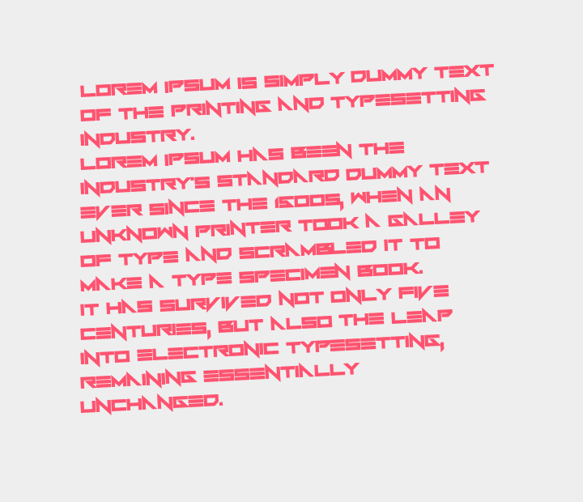

Text2Image
=======

The most useful & easy2use PHP library for converting any text into image  
Version : 1.0 Beta  
Requirements: PHP-GD  

Text2Image was created basically for translating any text information into an image representation.  
And the point is, that there are no other libs for this task, at least there are no such easy4use libs for such tasks.  
So all you need is require header file of this lib, create an instance and call "output" or "save" function, that's it! :)

###About modes
There is exactly 2 modes in it, "Simple" and "Smart".  
The main difference between them is that "Simple" is a lot faster than "Smart".  
But, "Simple" mode not support's text-size and angle params.  
Also, to use custom fonts in "Simple" mode you need to convert them into GDF.  
With "Smart" mode you can use any font's you want, of course, if they are supported by GD, for example, TTF work nice.  
See "List of all public methods" below for understanding how to switch between this modes.  

###List of all public params:

* $width = 720, // Width of image box, text will be wrapped withing this box [int]
* $font = 5, // Font name/family, can be integer font index for Simple mode, or path to TrueType font for Smart mode [int] or [string]
* $line_height = 'auto', // Height between lines, can be integer or 'auto' [int] or [string]
* $background_color = array(38, 50, 56), // Color of background, can be array of RGB values, or a hex string [array] or [string]
* $text_color = array(255, 255, 255), // Color of text, can be array of RGB values, or a hex string [array] or [string]
* $padding = 30, // Padding by all side's [int]
* $angle = 0, // smart-only Text angle [int]
* $text_size = 17, // smart-only Font size [int]
* $user_fonts = array(); // User defined font's

###List of all public methods:
* get_mode() - Return current mode, true is "Simple", false is "Smart" [boolean]
* set_mode($mode) - Allows you to switch between modes, accepts "simple" or "smart" string in first parameter
* get_text() - Return source text
* set_text($new_text) - Allows you to set new text
* add_font($label, $path, $[force_mode = null]) - Using this you can easy add any font you want, by adding "label" you can name added font as you want, "path" defines path to you'r font, "force_mode" can be used to force used mode on font load operation (1 is "Simple", 0 is "Smart")
* get_font($label) - Use this to get loaded font index by it's label, then you can pass this index into "font" param
* is_imagetype_supported($type) - Return's True if passed type is supported by you'r PHP build, and false if it's not
* output($type = 'png', $quality = 100) - Output result image into browser
* save($path, $type = 'png', $quality = 100) - Allows you to save result image into image, "quality" parameter is supported only with 'jpg' or 'png' image types

Also, see "examples" folder for more.

###Basic usage example
```php
<?php

require "../src/magic.class.php"; // manual include, instead you can use composer

$test = new Priler\Text2Image\Magic('Hello world!');
$test->output();
```

Example output:


###Beautiful smart-mode text using angle

```php
<?php

require "../src/magic.class.php"; // manual include, instead you can use composer

$test = new Priler\Text2Image\Magic(
"
Lorem Ipsum is simply dummy text of the printing and typesetting industry.
Lorem Ipsum has been the industry's standard dummy text ever since the 1500s, when an unknown printer took a galley of type and scrambled it to make a type specimen book.
It has survived not only five centuries, but also the leap into electronic typesetting, remaining essentially unchanged.
"
);

// force mode into smart
$test->set_mode('smart');

// load custom font
// smart-mode work's exactly with .TTF, but other font's may also be supported, see PHP GD docs for more info
$test->add_font('MyFont', './assets/foughtknight.ttf');
$test->font = $test->get_font('MyFont');

// also, smart mode supports text-size property and angle property (last one shown in 5th example)
$test->text_size = 20;
//ANGLE GOES HERE
$test->angle = 3;//negative values also supported

// let's change some basic stuff
$test->background_color = '#eee'; // custom background color
$test->text_color = '#FF5370'; // custom text color
$test->padding = 100; // custom padding


// this settings is same as on 4th example
$test->width = 720; // custom width
$test->line_height = 30; // custom line height


$test->output();
```


